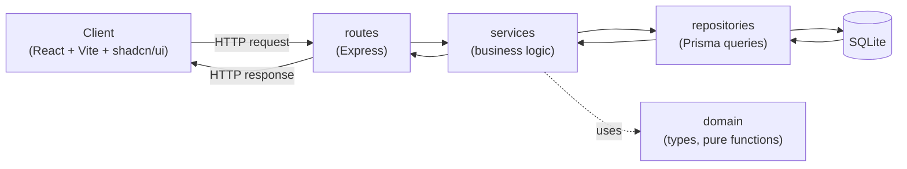

# Architecture — Salary Management Software

## Overview
A layered backend with a clean separation of concerns, backed by SQLite via
Prisma, serving a React + Vite + shadcn/ui frontend over HTTP. The layering
exists so business logic (currency normalization, analytics) stays testable
and decoupled from HTTP and SQL, and so future features — e.g. salary-change
history in round 2 — slot in without reworking existing code.

## Layers
- **routes** (Express) — HTTP only: parse and validate the request, call a
  service, shape the response. No business logic.
- **services** — business logic: analytics calculations, currency
  normalization, orchestration across repositories. Knows nothing about
  HTTP or SQL.
- **repositories** — data access via Prisma: queries, pagination,
  aggregation.
- **domain** — types and pure functions (e.g. currency conversion). No I/O.

Each layer only calls the layer directly below it.

## Request Flow

Client → Express route → Service → Repository → Prisma → SQLite, and the
result flows back up the same path. Services may call into `domain` for pure
calculations (e.g. converting an amount to USD) without any I/O.

## Key Decisions

**1. Layered separation.** Each layer has a single responsibility and can be
tested in isolation (e.g. a service test mocks its repository instead of
hitting SQLite). This also means a new feature — like salary-change history —
adds a new repository method and service call without touching routes or
unrelated logic.

**2. Multi-currency storage and normalization.** Each salary is stored in its
**native currency** (amount + ISO currency code) so source data stays
faithful to what was actually paid. When aggregating across employees (totals,
averages, department/country breakdowns), the service layer normalizes
amounts to a base currency (USD) using a rate table. This keeps individual
records accurate while making org-wide comparisons meaningful.

**3. Aggregation in the database, not in memory.** Pagination, filtering, and
aggregate calculations (sums, averages, group-by) are pushed down to Prisma
queries against SQLite rather than loaded into application memory and
computed in JS. This keeps the app responsive at 10k+ rows and beyond.

**4. Test pyramid.** The bulk of tests are fast unit tests against `domain`
and `services`, run against an in-memory SQLite database. A smaller number of
integration tests exercise the API end-to-end. All tests are deterministic —
no reliance on wall-clock time, network calls, or live exchange rates.

**5. Why SQLite + Prisma.** Zero-config (no separate database server to run),
trivial to seed with 10k synthetic employee rows, easy to deploy, and
supports an in-memory mode that keeps the test suite fast.

## Data Model (high level)

**Employee** — `id`, `name`, `email`, `department`, `country`, `role`,
`salaryAmount`, `salaryCurrency`, `joinedAt`

**CurrencyRate** — `currencyCode`, `rateToUsd`

This is a sketch, not the final Prisma schema — field types, constraints, and
indexes are decided when the schema is written.
